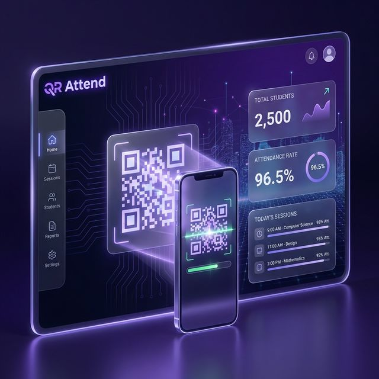

# 📋 QR Attend — Smart Attendance Management System



A professional, high-performance **QR code-based attendance management system** designed for modern educational institutions. Built with a powerhouse stack of **React 18**, **TypeScript**, **Vite**, and **Firebase**, it delivers a seamless, real-time experience across all devices.

---

## ✨ Overview

QR Attend revolutionizes the traditional attendance process by replacing manual registers and paper sheets with a secure, digital-first approach. It features dedicated portals for **Administrators**, **Faculty**, and **Students**, all wrapped in a premium **Glassmorphism** design system with support for both **Dark** and **Light** modes.

### 🌐 Key Links
- **Live Demo:** [Available on Vercel](https://qr-attend.vercel.app)
- **Tech Stack:** React, TypeScript, Firebase, Lucide, Vite

---

## 🚀 Role-Based Features

### 👨‍💼 Administrator Portal (Command Center)
*   **Intelligent Dashboard:** Zero-effort overview of institution health, including global attendance rates and active sessions.
*   **User Management:** Centralized control over Teacher and Student accounts with automated ID generation.
*   **Academic Structure:** Manage departments, semesters, classes, and sections with ease.
*   **Curriculum Mapping:** Assign subjects to specific teachers and link them to class sections.
*   **Advanced Analytics:** Generate comprehensive attendance reports with CSV export capabilities for institutional audits.

### 👩‍🏫 Faculty Panel (Classroom Management)
*   **Session Generation:** Create unique, time-bound QR sessions for any assigned subject with a single click.
*   **Live Tracking:** Watch student attendance populate in real-time as they scan the QR code.
*   **Security Controls:** Each QR session features an auto-expiry timer (5 minutes) to eliminate proxy attendance.
*   **Performance Tracking:** Detailed student-wise attendance breakdown with progress visualizations.

### 👨‍🎓 Student Portal (Personal Attendance)
*   **Interactive Dashboard:** Visual attendance tracker with animated percentage charts and status cards.
*   **Smart Scanner:** High-speed QR scanner interface with manual entry fallback for tricky lighting conditions.
*   **History Logs:** Full transparency into personal attendance records, filtered by subject or status (Present/Absent).
*   **Real-time Feedback:** Instant confirmation and "Toast" notifications upon successful attendance marking.

---

## 🛠️ The Powerhouse Tech Stack

| Technology | Role |
| :--- | :--- |
| **React 18** | High-performance UI library with modern hook-based architecture. |
| **TypeScript** | Strict type-safety across the entire application for rock-solid reliability. |
| **Firebase** | Real-time synchronization and cloud persistence for instant data updates. |
| **Lucide React** | A consistent, high-quality iconography system for intuitive navigation. |
| **Vite** | The next-generation build tool for ultra-fast development and optimized bundles. |
| **CSS3 (Modern)** | Fully custom design system featuring CSS variables, animations, and glassmorphism. |

---

## 🔒 Security & Sync

*   **Firebase Realtime DB:** Every attendance scan and session update is synchronized across all devices in milliseconds.
*   **Automatic Expiry:** QR codes become invalid after 5 minutes, preventing "after-class" scans or photo-sharing attendance.
*   **Duplicate Prevention:** Sophisticated data validation prevents students from marking attendance multiple times for the same session.
*   **Persistence Layer:** Combines LocalStorage caching with Cloud persistence for a "Work Anywhere" experience.

---

## ⚙️ Installation & Setup

### Prerequisites
- **Node.js** (v18.0.0 or higher)
- **npm** (v9.0.0 or higher)

### Local Development
```bash
# 1. Clone the repository
git clone https://github.com/your-username/qr-attend.git

# 2. Enter the project directory
cd qr-attend

# 3. Install dependencies
npm install

# 4. Create a .env file for Firebase (Optional for local mode)
# See Firebase documentation to get these keys
VITE_FIREBASE_API_KEY=your_key
VITE_FIREBASE_AUTH_DOMAIN=your_domain
VITE_FIREBASE_DATABASE_URL=your_db_url
VITE_FIREBASE_PROJECT_ID=your_project_id
VITE_FIREBASE_STORAGE_BUCKET=your_bucket
VITE_FIREBASE_MESSAGING_SENDER_ID=your_sender_id
VITE_FIREBASE_APP_ID=your_app_id

# 5. Launch the development server
npm run dev
```

The application will launch at `http://localhost:5173`.

---

## 🔑 Demo Access

Quick-test the platform using these pre-configured credentials:

| Role | Email | Password |
| :--- | :--- | :--- |
| **Admin** | `admin@university.edu` | `admin123` |
| **Teacher** | `anita@university.edu` | `teacher123` |
| **Student** | `sanjana@student.edu` | `student123` |

> 💡 **Pro-Tip:** Use the **"Fill Demo Credentials"** button on the login page for instant access!

---

## 📁 Project Architecture

```text
src/
├── components/     # Reusable UI components (Sidebar, Stats, etc.)
├── context/        # Global state (Auth, Theme, Notifications)
├── lib/            # External service integrations (Firebase)
├── pages/          # Full-page views organized by role
│   ├── admin/      # Management dashboards
│   ├── teacher/    # Session generation tools
│   └── student/    # Scanning and tracking tools
├── store/          # Data models and CRUD logic
└── styles/         # Global design system & theme tokens
```

---

## 📜 License

Distributed under the **MIT License**. See `LICENSE` for more information.

---

Built with ❤️ by **Sanjana K S**

