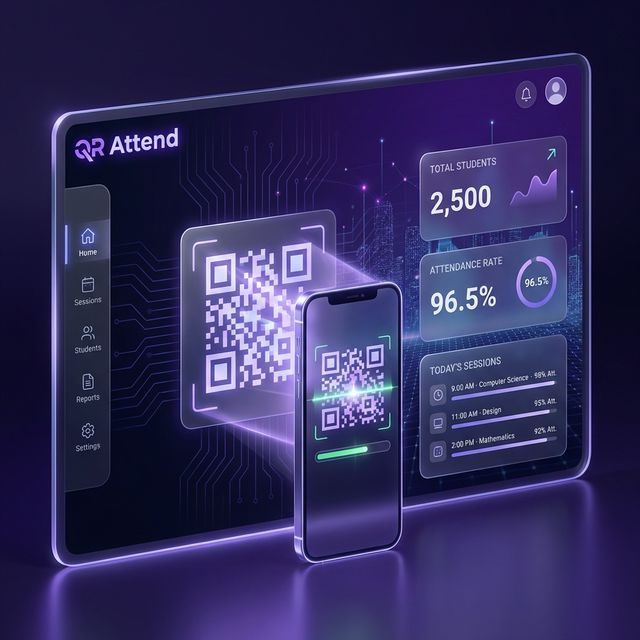

# 📋 QR Attend — Smart Attendance Management System



A professional, high-performance **QR code-based attendance management system** designed for modern educational institutions. Built with a powerhouse stack of **React 18**, **TypeScript**, **Vite**, and **Firebase**, it delivers a seamless, real-time experience across all devices.

---

## 🛡️ Anti-Proxy Protection System

QR Attend features a **4-layer security architecture** to ensure attendance integrity and eliminate proxy marking.

*   **⚡ 5s QR Rotation:** QR codes automatically rotate every **5 seconds**. Screenshots and photo-sharing are rendered useless as the token expires before it can be shared.
*   **📱 Device Locking:** Each student's account is **permanently linked** to the first phone they use to scan. Only that specific device can mark attendance for their account.
*   **🔍 Same-Device Detection:** The system fingerprints every device. If one phone tries to mark attendance for multiple students, it's instantly flagged.
*   **📊 Violation Logging:** Unauthorized attempts (wrong device, expired QR, etc.) are logged with full details for Admin and Teacher review.

---

## ⚙️ Detailed Working Mechanism (Anti-Proxy Logic)

To ensure 100% attendance integrity, the system follows a sophisticated backend validation flow:

### 1. Dynamic QR Tokenization (The "5-Second Rule")
Every session generates a cryptographically random token that is embedded into the QR code. 
- **Rotation:** The teacher's dashboard generates a new token every **5 seconds**.
- **Grace Period:** The system allows a tiny overlap (last 1 token) to account for network latency, but any scan older than ~7 seconds is rejected.
- **Result:** Screenshots sent via social media reach the recipient too late to be valid.

### 2. Hardware Fingerprinting & Device Binding (The "Phone Memory")
The system uses a unique hardware-based fingerprinting algorithm to identify each physical device.
- **Registration Phase:** On the student's **first-ever scan**, the system captures their unique `deviceId` and saves it to their profile as `registeredDeviceId`. This is the "Phone Memory".
- **Validation Phase:** On every subsequent scan, the system compares the current phone's ID with the stored `registeredDeviceId`.
- **Enforcement:** If a student tries to scan using a friend's phone or a second device, the system detects the mismatch and **blocks the attendance**, logging a "Wrong Device" violation.

### 3. One-to-One Mapping (The "Proxy Block")
Even if a student uses their own registered phone, the system prevents them from being a "Proxy" for others.
- **Detection:** If Phone A marks attendance for Student 1, and then tries to mark attendance for Student 2 in the same session, the system flags it as **"Same Device Proxy Detected"**.
- **Result:** Students cannot pass one phone around the room to mark multiple people present.

### 4. Administrative Override
In case a student legitimately changes their phone (lost phone, new purchase):
- **Reset Process:** The Student must contact the **Admin**.
- **Action:** The Admin can "Reset Device" in the User Management panel, which clears the "Phone Memory".
- **Re-binding:** The student can then scan using their new phone, which becomes their new registered device.

---

## 🔄 How It Works (Role-Based Workflow)

### 1. 👩‍🏫 Teacher Side: Session Creation
- **Choose Subject:** Teacher selects the subject from their assigned list.
- **Set Duration:** Teacher defines how long the attendance window remains open.
- **Live QR Generation:** A unique QR code is generated. This QR code **changes every 5 seconds**.
- **Monitoring:** Teacher watches the live dashboard as students appear in real-time. Any proxy attempts appear with red/yellow warning badges.

### 2. 👨‍🎓 Student Side: Smart Scanning
- **Open Scanner:** Student logs in and selects the "Scan QR" feature.
- **Camera Scan:** Student points their camera at the teacher's screen.
- **Validation:**
    - System verifies they are using their **registered phone** (stored in phone memory).
    - System checks if they are in the correct class.
    - System checks for same-device proxy flags.
- **Instant Result:** Success result is shown, and attendance is saved instantly to the cloud.

### 3. 👨‍💼 Admin Side: Oversight & Auditing
- **Live Activity:** Admin monitors global activity via the dashboard activity feed.
- **Proxy Management:** Admin reviews all auto-logged proxy alerts.
- **Data Export:** Generate detailed attendance sheets in CSV format.
- **Device Support:** Admin can "Reset Device" for students as needed.

---

## ✨ Overview

QR Attend revolutionizes the traditional attendance process with a secure, digital-first approach. It features dedicated portals for **Administrators**, **Faculty**, and **Students**, wrapped in a premium **Glassmorphism** design system.

### 🌐 Key Links
- **Live Demo:** [Available on Vercel](https://qr-attend.vercel.app)
- **Tech Stack:** React, TypeScript, Firebase, Lucide, Vite

---

## 🛠️ The Powerhouse Tech Stack

| Technology | Role |
| :--- | :--- |
| **React 18** | High-performance UI library. |
| **TypeScript** | Strict type-safety for reliability. |
| **Firebase** | Real-time synchronization and cloud persistence. |
| **Lucide React** | Consistent, high-quality iconography. |
| **Vite** | Ultra-fast development and optimized builds. |
| **CSS3 (Modern)** | Custom design system with glassmorphism. |

---

## ⚙️ Installation & Setup

```bash
# 1. Clone & Install
git clone https://github.com/your-username/qr-attend.git
cd qr-attend
npm install

# 2. Launch
npm run dev
```

---

## 🔑 Demo Access

| Role | Email | Password |
| :--- | :--- | :--- |
| **Admin** | `admin@university.edu` | `admin123` |
| **Teacher** | `anita@university.edu` | `teacher123` |
| **Student** | `sanjana@student.edu` | `student123` |

---

## 📜 License

Distributed under the **MIT License**. See `LICENSE` for more information.
